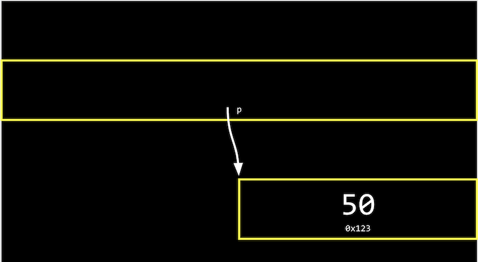
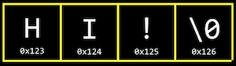
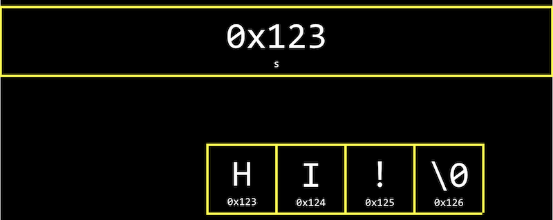

# Memory: Address, Pointer, Allocation

## Hexadecimal 十六進位制
- 敘述記憶體位址時，使用的是「十六進位制」。
- 0 ~ 9 加上 A ~ F (代表 10 ~ 15)。
- 例如： 十進位的 `14` 在十六進位中即 `0E`；十進位的 `28` 在十六進位中即 `1C`。
- 在兩位數的十六進位中，最大值即 `FF`，代表 $(16^1)15+(16^0)15=255$，與 8 bits 的二進位相同。
- 一般表示上，會在十六進位的值前加上 `0x`，例如 `0x10` 表示 `16`。(在十六進位中 `10` 為十進位的 `16`。)
- RGB色彩由6碼組成，前兩碼為紅色的量、中間兩碼為綠色的量、最後兩碼為藍色的量。如：`000000` 指紅、綠、藍的量均為0，即黑色；`FFFFFF` 指紅、綠、藍的量最大(255)，即白色。

## Address 位址
- 在宣告變數時，即在記憶體中儲存。例如：
    ```c
    #include <stdio.h>

    int main(void)
    {
        int n = 50;
        printf("%i\n", n);
    }
    ```
- 以上程式碼代表電腦會在記憶體中找出一個 4 byte (整數值佔用4位元組)，並儲存一整數 50，並命名為 `n`。
- 在 C 語言中，可以透過 `&` 運算子，取得物件的記憶體位址，而 `%p` 為位址的格式碼。
    ```c
    #include <stdio.h>

    int main(void)
    {
        int n = 50;
        printf("%p\n", &n);
    }
    ```
    - `&n` 表示取得 n 的記憶體位址。
    - `%p` 表示其格式為記憶體位址。
- 記憶體位址可能為(如)：`0x7ffd80792f7c`，此為透過十六進位表示的記憶體位址。
- 在 C 語言中，`*` 運算子可用於取得該記憶體位址中的內容，即前往並取得該指標所指的內容
    - 原文：The `*` operator, or the dereference operator, allows us “go to” the location that a pointer is pointing to.
    ```c
    #include <stdio.h>

    int main(void)
    {
        int n = 50;
        printf("%i\n", *&n);
    }
    ```
    - `&n` 為 n 的記憶體位址。
    - `*&n` 為前往 n 記憶體位址並取得其內容，即 50。

## Pointer 指標
- 儲存記憶體位址的變數稱為「指標」，用於指向記憶體中某個位置。
    ```c
    #include <stdio.h>

    int main(void)
    {
    int n = 50;
    int *p = &n;
    printf("%p\n", p);
    }
    ```
    - `int *p = &n` 表示 `p` 為 n 的指標，儲存 n 所在位址的資訊(如：`0x123`)，並透過 `*` 來取得該位址中的內容，即 50。
    - `int *`：宣告一內容為 int 的位址。
    - `&n`：n 的記憶體位址。
    - `p`：n 的記憶體位址。
- 儲存與指標的情況如下圖：
    
    
    - 現代的電腦系統大多為64-bit，即使用64個位元(8位元組)來儲存記憶體位址。

## Strings in Memory 字串在記憶體中的狀態
- 宣告字串時，一次儲存一個字母。
    - 如宣告字串 `s = "Hi!"`，可透過 `s[0]`, `s[1]`...來取得單獨字母。
- 事實上，每個字母同樣有自己的記憶體位址，如下圖。
    
- 字串的變數 `s`，實際上儲存的是 __字串第一個字的記憶體位址__。
    
- 不需儲存結尾，字串自動以 `\0` 做結尾。
- 事實上，`<cs50.h>` 所含的 `string`，即 C 語言中的 `char *` 類別。
    - `string s = "Hi!"` 即 `char *s = "Hi!"`。
    - `s` 為首字記憶體位址，`char *`代表該記憶體位址中的內容，而內容為一字母。

## Pointer Arithmetic 指標運算
- Pointer arithmetic 是指記憶體位址的運算。
- 可以直接透過 `char *` 的宣告，並使用 `s[i]` 指向每一個字母，也可以用「計算」的方式，因為同一字串會位於相鄰的記憶體位址。
    ```c
    int main(void)
    {
        char *s = "HI!";
        printf("%c\n", *s);
        printf("%c\n", *(s+1));
        printf("%c\n", *(s+2));
    }
    ```
    - 記憶體位址可以用數學運算來取得。
    - `*s`：前往該字串首字所在位址並取得內容。
    - `*(s+1)`：前往該字串第二字所在位址並取得內容。
- 實際上亦可透過以上方式抓取超出宣告範圍的記憶體位址，但可能會出現 `segmentation fault`，或程式崩潰(當程式碰到其不該使用的區段)。

## Allocation and Free 記憶體配置與釋放
### Allocation
- 透過 `malloc()` 來配置出一未使用的記憶體區段，括號內為所需使用的位元組(byte)數。例如：
    ```c
    char *x = malloc(5);
    ```
### Free
- 透過 `free()` 來釋放已配置的記憶體區段。使用完後務必記得釋放，否則記憶體容易過載。
    ```c
    free(x);
    ```

## Tool: valgrind
- `valgrind` 是一個 command-line 工具，可用於檢測是否有 __memory leak__、 __未釋放__ 的狀況等。
    ```c
    #include <stdio.h>
    #include <stdlib.h>

    int main(void)
    {
        char *s = malloc(3);
        s[0] = 'H';
        s[1] = 'I';
        s[2] = '!';
        s[3] = '\0';
        printf("%s\n", s);
    }
    ```
    - run `valgrind ./memory`，將出現以下錯誤：
        - "Invalid write of size 1"：`malloc` 僅宣告3個bytes，但寫入時共使用4個。
        - "Invalid read of size 1"：`printf` 印出的字串為 4 bytes，超出記憶體配置的3個。
        - "3 bytes in 1 blocks are definitely lost"：共3個 bytes，1個 block 的記憶體經配置後未釋放。

## Garbage Value
```c
int main(void)
{
    int *x;
    int *y;

    x = malloc(sizeof(int));

    *x = 42;
    *y = 13;

    y = x;

    *y = 13;
}
```
- 宣告兩個指向指數的 pointer，`x`與`y`，但未指定其值。
- `*x = 42`可正常指定 x 的內容為 42；但`*y = 13`無法，因為該位址原先已有其他值在內(garbage value)，但未使用`malloc()`來取得一段空的記憶體區段來使用。
- 可以藉由宣告空的且未指定值的 array 將 garbage value 印出：
    ```c
    #include <stdio.h>

    int main(void)
    {
        int scores[3];
        for (int i = 0; i < 3; i++)
        {
            printf("%i\n", scores[i]);
        }
    }
    ```