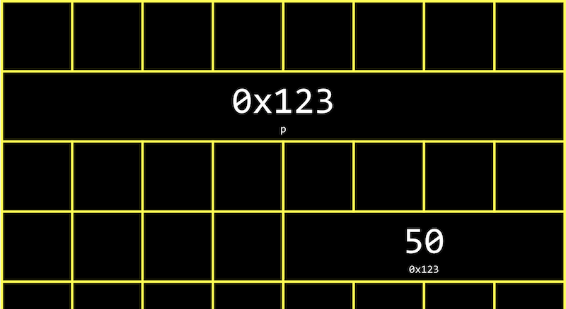

# Memory: Address, Pointer, Allocation

## Hexadecimal 十六進位制
- 敘述記憶體位址時，使用的是「十六進位制」。
- 0 ~ 9 加上 A ~ F (代表 10 ~ 15)。
- 例如： 十進位的 `14` 在十六進位中即 `0E`；十進位的 `28` 在十六進位中即 `1C`。
- 在兩位數的十六進位中，最大值即 `FF`，代表 $(16^1)15+(16^0)15=255$，與 8 bits 的二進位相同。
- 一般表示上，會在十六進位的值前加上 `0x`，例如 `0x10` 表示 `16`。(在十六進位中 `10` 為十進位的 `16`。)
- RGB色彩由6碼組成，前兩碼為紅色的量、中間兩碼為綠色的量、最後兩碼為藍色的量。如：`000000` 指紅、綠、藍的量均為0，即黑色；`FFFFFF` 指紅、綠、藍的量最大(255)，即白色。

## RAM 隨機快取記憶體
- 電腦的資料一般存在 hard disk drive (HDD) 或 solid-state drive (SSD) 內。
- 在 HDD 或 SSD 內的資料無法直接被操作或取用，需提取至 RAM 中才能。

## Address 位址
- 在宣告變數時，即在記憶體中儲存。例如：
    ```c
    #include <stdio.h>

    int main(void)
    {
        int n = 50;
        printf("%i\n", n);
    }
    ```
- 以上程式碼代表電腦會在記憶體中找出一個 4 byte (整數值佔用4位元組)，並儲存一整數 50，並命名為 `n`。
- __在 C 語言中，可以透過 `&` 運算子，取得物件的記憶體位址，而 `%p` 為位址的格式碼。__
    ```c
    #include <stdio.h>

    int main(void)
    {
        int n = 50;
        printf("%p\n", &n);
    }
    ```
    - `&n` 表示取得 n 的記憶體位址。
    - `%p` 表示其格式為記憶體位址。
- 記憶體位址可能為(如)：`0x7ffd80792f7c`，此為透過十六進位表示的記憶體位址。
- __在 C 語言中，`*` 運算子 (dereference operator) 可用於取得該記憶體位址中的內容，即前往並取得該指標所指的內容。__
    - 原文：The `*` operator, or the dereference operator, allows us “go to” the location that a pointer is pointing to.
    ```c
    #include <stdio.h>

    int main(void)
    {
        int n = 50;
        printf("%i\n", *&n);
    }
    ```
    - `&n` 為 n 的記憶體位址。
    - `*&n` 為前往 n 記憶體位址並取得其內容，即 50。

## Pointer 指標
- 儲存記憶體位址的變數稱為「指標」，用於指向記憶體中某個位置。
- Pointer 可使資料結構或(以及)變數在 function 之間易於共同使用，而非只是傳遞變數的複製品。(一般而言，傳入函數內的東西是變數的複製品而非其本身)
- 使用`&`來表示其 address；使用`*`來表示其 address 內的內容物。
    ```c
    #include <stdio.h>

    int main(void)
    {
    int n = 50;
    int *p = &n;
    printf("%p\n", p);
    }
    ```
    - `int *p = &n` 表示 `p` 為 n 的指標，儲存 n 所在位址的資訊(如：`0x123`)，並透過 `*` 來取得該位址中的內容，即 50。
    - `int *`：宣告一內容為 int 的位址。(`int *p` 亦可寫作 `int* p`)
    - `&n`：n 的記憶體位址。
    - `p`：n 的記憶體位址。
- 儲存與指標的情況如下圖：
    
    
    - 現代的電腦系統大多為64-bit，即使用64個位元(8位元組)來儲存記憶體位址。
- __注意：創建出 pointer 後若並未立即指定變數，我們應永遠使該 pointer 指向 `NULL`。如此一來，當我們嘗試 derefernce 該變數時，會得到 segmentation fault，而非一個隨機且未知來源的值，避免混亂。__
    ```c
    int *x = NULL;
    ```

## Strings in Memory 字串在記憶體中的狀態
- 宣告字串時，一次儲存一個字母。
    - 如宣告字串 `s = "Hi!"`，可透過 `s[0]`, `s[1]`...來取得單獨字母。
- 事實上，每個字母同樣有自己的記憶體位址，如下圖。
    
- 字串的變數 `s`，實際上儲存的是 __字串第一個字的記憶體位址__。
    
- 不需儲存結尾，字串自動以 `\0` 做結尾。
- 事實上，`<cs50.h>` 所含的 `string`，即 C 語言中的 `char *` 類別。
    - `string s = "Hi!"` 即 `char *s = "Hi!"`。
    - `s` 為首字記憶體位址，`char *`代表該記憶體位址中的內容，而內容為一字母。
    - 因為 `char *` 實際上儲存的是記憶體位址，因此其大小為 4 bytes (in 32-bit system) 或 8 bytes (in 64-bit system)，`int *`、`float *` 等亦然。

## Pointer Arithmetic 指標運算
- Pointer arithmetic 是指記憶體位址的運算。
- 可以直接透過 `char *` 的宣告，並使用 `s[i]` 指向每一個字母，也可以用「計算」的方式，因為同一字串會位於相鄰的記憶體位址。
    ```c
    int main(void)
    {
        char *s = "HI!";
        printf("%c\n", *s);
        printf("%c\n", *(s+1));
        printf("%c\n", *(s+2));
    }
    ```
    - 記憶體位址可以用數學運算來取得。
    - `*s`：前往該字串首字所在位址並取得內容。
    - `*(s+1)`：前往該字串第二字所在位址並取得內容。
- 實際上亦可透過以上方式抓取超出宣告範圍的記憶體位址，但可能會出現 `segmentation fault`，或程式崩潰(當程式碰到其不該使用的區段)。

## Dynamic Memory Allocation 動態記憶體配置
### Allocation
- 透過 `malloc()` 來配置出一未使用的記憶體區段，括號內為所需使用的位元組(byte)數。例如：
    ```c
    char *x = malloc(5);
    ```
- 亦可直接針對某一資料型態動態配置出適合的大小，如：
    ```c
    int *px = malloc(sizeof(int));
    ```
- 若 `malloc()` 無法配置出記憶體空間，則該函數將回傳 `NULL`。在進行動態記憶體配置時，應進行確認，如下：
    ```c
    char *x = malloc(5);
    if (x = NULL)
    {
        return 1;
    }
    ```
### Free
- 透過 `free()` 來釋放已配置的記憶體區段。使用完後務必記得釋放，否則記憶體容易過載。
    ```c
    free(x);
    ```
- 未將使用完畢的記憶體空間歸還給作業系統，可能將導致 __memory leak__，將影響電腦效能。
- Three golden rules:
    1. Every block of memory that you `malloc()` must be subsequently be `free()`d.
    2. Only memory that you `malloc()` should be `free()`d.
    3. Do not `free()` a block of memory more that once.

## Memory Layout

- "machine code" 與 "global variabls" 位在記憶體最上層。
- 透過 `malloc()` 所配置的空間會位於 "heap"，並逐漸往下配置。
- 然而，程式與函數的呼叫則會從 "stack" 開始往上疊，例如最下層的 stack 為 `main()`，若主程式呼叫其他 function，則往上疊加。
- 兩種記憶體配置方式：
    - Array of floats on the stack
        ```c
        float *stack_array[x];
        ```
    - Array of floats on the heap
        ```c
        float *heap_array = malloc(x * sizeof(float));
        ```

## Call Stack
- 當 function 被呼叫時，其將一層一層被 pushed onto stack，堆疊於 stack，並且同一時間僅有最上層的 function 在運作，其他 function 都在暫停狀態，等待上一層 function call 的回覆。最上層的 function 回覆後其將自動被 popped off，並且由下一層 function 接著工作，直到最底層的 `main()`。
- 原文，by Doug Lloyd：
    - These frames are arranged in a "stack". The frame of most-recently called function is always on the top of the stack.
    - When a new function is called, the new frame is __pushed onto__ the top of the stack and become the active frame.
    - When a function finishes its work, its frame is __popped off__ of the stack, and the frame immediately below it becomes the new and active function on the top of the stack. This function picks up immediately where it left off.

## Buffer Overflow 緩衝區溢位
- A __buffer overflow__ occurs when we go past the end of a buffer, some chunk of memory we’ve allocated like an array, and access memory we shouldn’t be.


## Tool: valgrind
- `valgrind` 是一個 command-line 工具，可用於檢測是否有 __memory leak__、 __未釋放__ 的狀況等。
    ```c
    #include <stdio.h>
    #include <stdlib.h>

    int main(void)
    {
        char *s = malloc(3);
        s[0] = 'H';
        s[1] = 'I';
        s[2] = '!';
        s[3] = '\0';
        printf("%s\n", s);
    }
    ```
    - run `valgrind ./memory`，將出現以下錯誤：
        - "Invalid write of size 1"：`malloc` 僅宣告3個bytes，但寫入時共使用4個。
        - "Invalid read of size 1"：`printf` 印出的字串為 4 bytes，超出記憶體配置的3個。
        - "3 bytes in 1 blocks are definitely lost"：共3個 bytes，1個 block 的記憶體經配置後未釋放。

## Garbage Value
```c
int main(void)
{
    int *x;
    int *y;

    x = malloc(sizeof(int));

    *x = 42;
    *y = 13;

    y = x;

    *y = 13;
}
```
- 宣告兩個指向指數的 pointer，`x`與`y`，但未指定其值。
- `*x = 42`可正常指定 x 的內容為 42；但`*y = 13`無法，因為該位址原先已有其他值在內(garbage value)，但未使用`malloc()`來取得一段空的記憶體區段來使用。
- 可以藉由宣告空的且未指定值的 array 將 garbage value 印出：
    ```c
    #include <stdio.h>

    int main(void)
    {
        int scores[3];
        for (int i = 0; i < 3; i++)
        {
            printf("%i\n", scores[i]);
        }
    }
    ```