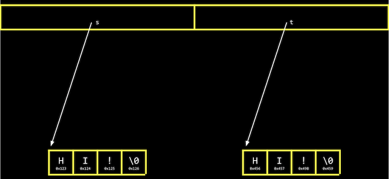
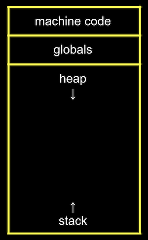

# Memory: Applications

## String Compare and Copy 字串比較與複製
### Compare 字串比較
```c
#include <cs50.h>
#include <stdio.h>

int main(void)
{
    char *s = get_string("s: ");
    char *t = get_string("t: ");

    if (s == t)
    {
        printf("Same\n");
    }
    else
    {
        printf("Different\n");
    }
}
```
- 以上程式碼即便輸入相同的字串，仍會顯示為"Different"。
- 在 C 語言中，每個字串實際上只是不同的 pointer，指向不同的記憶體位址。即便內容(字串)是一樣的，`t`與`s`實際上是不同位址；而 `s == t` 實際上是拿兩個記憶體位址在做比較。
    
- 直接使用 `strcmp(s, t)` 即可。

### Copy 字串複製
```c
#include <cs50.h>
#include <ctype.h>
#include <stdio.h>

int main(void)
{
    char *s = get_string("s: ");

    char *t = s;

    t[0] = toupper(t[0]);

    printf("s: %s\n", s);
    printf("t: %s\n", t);
}
```
- 使用者輸入字串`s`，並將`t`的首字大寫。然最後結果卻是`s`與`t`都有首字大寫。
- 因為`s`實為記憶體位址，而將`s`指定給`t`，實際複製的是記憶體位址，即兩者指向的實際上是一樣的字串。
- 以下程式碼可實現字串的複製。
```c
#include <cs50.h>
#include <ctype.h>
#include <stdio.h>
#include <stdlib.h>
#include <string.h>

int main(void)
{
    char *s = get_string("s: ");

    char *t = malloc(strlen(s) + 1);
    if (t == NULL)
    {
        return 1;
    }

    for (int i = 0, n = strlen(s); i < n + 1; i++)
    {
        t[i] = s[i];
    }

    if (strlen(t) > 0)
    {
        t[0] = toupper(t[0]);
    }

    printf("s: %s\n", s);
    printf("t: %s\n", t);

    free(t);
}
```
- 宣告一變數`t`，透過`malloc(strlen(s) + 1)`配置一段記憶體空間。注意：`strlen()`計算字串長度時未含`\0`，因此配置時需加上。
- 然後，透過迴圈將`s`內的每個字元複製到`t`內。
- 此時`s`與`t`實際指向不同記憶體位址，因此字串複製成功。
- `if (t == NULL)`：當電腦記憶體用盡，`malloc`會回傳`NULL`。
- 使用`malloc`後務必記得`free`。

## Memory Layout

- "machine code" 與 "global variabls" 位在記憶體最上層。
- 透過 `malloc()` 所配置的空間會位於 "heap"，並逐漸往下配置。
- 然而，程式與函數的呼叫則會從 "stack" 開始往上疊，例如最下層的stack為`main()`，若主程式呼叫其他function，則往上疊加。

## Buffer Overflow 緩衝區溢位
- A __buffer overflow__ occurs when we go past the end of a buffer, some chunk of memory we’ve allocated like an array, and access memory we shouldn’t be.

## Swap 交換
```c
#include <stdio.h>

void swap(int *a, int *b);

int main(void)
{
    int x = 1;
    int y = 2;

    printf("x is %i, y is %i\n", x, y);
    swap(&x, &y);
    printf("x is %i, y is %i\n", x, y);
}

void swap(int *a, int *b)
{
    int tmp = *a;
    *a = *b;
    *b = tmp;
}
```
- 注意：傳入`swap()`函數的東西應為兩個 "pointers"。若直接傳入`x`與`y`，則函數雖可執行但`x`與`y`並未交換。因為函數`swap()`與主程式`main()`所在的stack不同。
- 將 `&x`、`&y`(兩個記憶體位址，pointer)傳入：
    - 先將x的內容暫存於`tmp`。
    - 再將y的內容置於x原本所在位置。
    - 最後將暫存的內容放入原先y所在位置。

## scanf
- 在 `cs50.h` 中，`get_int()`與`get_string`實際上是透過`scanf()`達成，可用於取得使用者輸入的內容。
### int
```c
#include <stdio.h>

int main(void)
{
    int x;
    printf("x: ");
    scanf("%i", &x);
    printf("x: %i\n", x);
}
```
- 在`scanf()`中傳入`&x`，表示輸入的內容應位於原先宣告的`x`的位址。

### string
```c
#include <stdio.h>

int main(void)
{
    char *s = malloc(4);
    printf("s: ");
    scanf("%s", s);
    printf("s: %s\n", s);
}
```
- 需預先宣告字串所需的記憶體空間，也可透過 `char s[4];` 來達成同樣效果，取得4個 bytes 的字串空間。
- `s`會被視為 pointer。
- 若使用者輸入超過 `malloc()` 所配置的 bytes 數，程式可能會 crash。