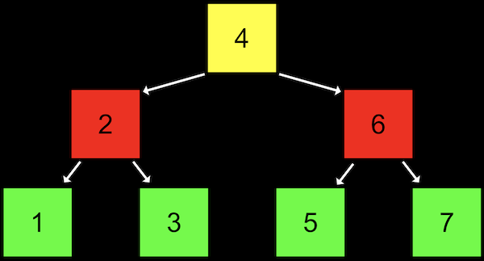
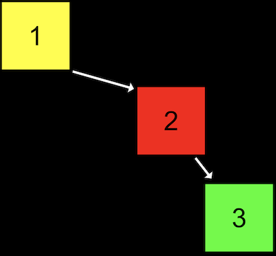

# Tree and Others 樹狀資料結構與其他資料結構

## Tree
### Concepts


- 樹狀結構是一個 __「已排序(sorted)」__ 的資料結構。
- 視覺上為 2-dimensional 結構，但實際上其可能在記憶體任意位置(仰賴 pointer)。
- 對樹狀結構每一個 node 而言，都指向另外兩個 __children__，一個指向比自己小者、另一個指向比自己大者。
- 便於利用 binary search，因此圖片所示為 __binary search tree__。
- 可以透過 __「遞迴(recursion)」__ 的方式來實現此結構。
- 類似於 linked list，我們會需要一個 pointer 指向 `root` (or say, the top center)，即圖片上的`4`。

### Time Complexity

- 新增時的時間複雜度為$O(\log n)$。
    - 例如上圖，若要新增`8`：從4開始，到6、再到7，最後新增8進入結構中，需耗費3步驟，因此資料量`n`為8時 insertion 的時間複雜度為3，即$\log_2 8=3$。因此時間複雜度為$O(\log n)$。

### Inplementation

- Define a `node` structure.
    ```c
    typedef struct node
    {
        int number;
        struct node *left;
        struct node *right;
    }
    node
    ```
- 實作一個遞迴函式來執行樹狀結構搜尋。
    ```c
    // tree is a pointer to a node that is the root of the tree we're searching in.
    // number is the value we're trying to find in the tree.
    bool search(node *tree, int number)
    {
        // make sure tree exists and it is not NULL
        if (tree == NULL)
        {
            return false;
        }
        // If we're looking for a number that's less than the tree's number,
        // search the left side, using the node on the left as the new root
        else if (number < tree->number)
        {
            return search(tree->left, number);
        }
        // Otherwise, search the right side, using the node on the right as the new root
        else if (number > tree->number)
        {
            return search(tree->right, number);
        }
        // Finally, we've found the number we're looking for, so we can return true.
        // We can simplify this to just "else", since there's no other case possible
        else if (number == tree->number)
        {
            return true;
        }
    }
    ```
- 樹狀結構的代價是 __耗用更多記憶體空間__，因為每個節點需要儲存更多的資訊。

### Imbalanced Tree


- 如上圖，此為未平衡的結構，實際上就是一 linked list，因此應將其平衡，始能使用 binary tree search。

## Hash Table
### Concepts
- Hash table 具有幾乎為 constant time 的搜尋時間。
- Hash table 本質上就是 __陣列的 linked list__。
- Hash table 使用 Hash function，意指其接收輸入值後，將輸入的內容對應到某特定位置。如下圖，即根據名字開頭映射到相對應的字母。
    - Hash function：雜湊函數。It returns a nonnegative integer value called __hash code__.

- 然而，在 worst-case 下，若所有名字都以同一字母開頭，其將等同於一個 linked list。即便將字母索引擴充，從 aa 到 zz，也可能有相同狀況，無法最佳化搜尋時間。

### Time Complexity
- 搜尋時間在 worst-case 下仍形成 linked list，即便將資料預先分類(如分成4個類別)，搜尋步驟為$\frac{n}{4}$，因此 worst-case 時間複雜度仍是$O(n)$。 (實際上的搜尋時間確實下降，只不過以時間複雜度表示時無差別，因為在資料量趨近無限大的情況下，除以4幾乎等同於沒有增加搜尋效率。)
- 正常的平均情況下：
    - Insertion：$\theta(1)$
    - Deletion：$\theta(1)$
    - Searching：$\theta(1)$

## Trie
### Concepts
- __trie__ ,pronounced like “try”, and is short for “retrieval”.

- 每個陣列都有 A~Z，每個字母也都會對應到一個新的 A~Z 陣列。
- 搜尋名字時將隨著字母逐一往下搜尋，直到布林函數回傳此為結尾(如圖片中的 D, Y, E)。
- 若欲搜尋的名字不存在，則不會有 pointer 指向其某一個字母，因此可能在搜尋過程中即回傳 `false`。
- 新增時，只需從 root 建立正確的 pointer path 即可。
- Guaranteeing the mapping of unique key-value pairs.
- No datas share same key (or say, the roadmap) unless the datas are the same.

### Time Complexity
- 即便有成千上萬筆資料，但由於搜尋時是根據單一筆資料的字串長度而定，與總資料量`n`無關，因此時間複雜度為$O(1)$。
- 其代價是需要極大量的記憶體空間。
- Upper bound：
    - Insertion：$O(1)$
    - Deletion：$O(1)$
    - Searching：$O(1)$

### Inplementation (Only the Construction)
- 索引為某一大學建立年份，最終資料為大學名稱：
    ```c
    typedef struct _trie
    {
        char university[20];
        struct _trie *paths[10];
    }
    trie
    ```
    - We have 10 possible places (0~9) we can go for every pieces of digits.

## Abstract Data Structure
- There are even higher-level constructs, __abstract data structures__, where we use our building blocks of arrays, linked lists, hash tables, and tries to implement a solution to some problem.
- 被稱為 __抽象資料結構__ 是因為其主要是一種「實作資料結構的概念或方式」，而非實際的一種資料結構。

### Queue
- 最先被 加入(enqueue) 結構中的資料將最先被 離開(dequeue) 結構。first-in-first-out (FIFO)。
- 新增資料稱為 enqueue，移除資料稱為 dequeue。
- 例如透過複製的方式 resize 陣列時，先被新增的資料即先離開原陣列中(並複製到新的陣列)；或在 linked list 中加入節點或移除節點。

### Stack
- 與 queue 不同，最先被 加入(pushed) 結構中的資料將最先被 離開(pop) 結構。last-in-first-out (LIFO)。
- 新增資料稱為 pushed，移除資料稱為 pop。

### Dictionary
- we can map keys to values, such as words to their definitions. We can implement one with a hash table or an array, taking into account the tradeoff between time and space.