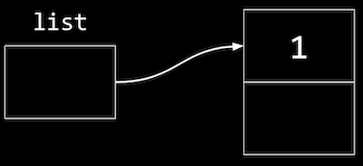
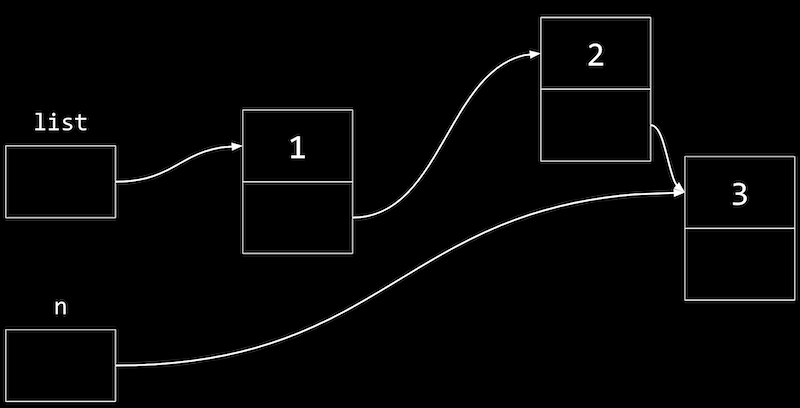
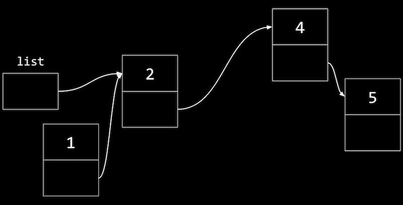

# Data Structure and Linked List 資料結構與鏈結串列

## Data Structure Operators
- `struct`：建立自訂義的資料結構。
- `.`：取得結構中的屬性。
- `*`：取得某一 pointer 所指位址的內容。
- `->`：取得某一 pointer 所指位址之結構中的屬性，即 `.` 與 `*` 共同作用。

## Resizing Arrays
### Concepts
- 「陣列」可以將同一類別的資料在記憶體中相鄰的位置儲存，`malloc` 亦然。
- 當需要在後方加入新的東西時，可能會面臨該陣列或該配置記憶體區段後方的記憶體區段已被使用的狀況。
- 其中一個解決方案，即重新配置一個更大的記憶體空間，並將原始資料複製過去，再新增欲加入的資料。

### Time Complexity
- 複製的過程中，時間複雜度為$O(n)$。
- 插入新資料的過程中，時間複雜度為$O(1)$。

### Inplementation
- 複製並新增
    ```c
    #include <stdio.h>
    #include <stdlib.h>

    int main(void)
    {
        // Use malloc to allocate enough space for an array with 3 integers
        int *list = malloc(3 * sizeof(int));
        if (list == NULL)
        {
            return 1;
        }

        // Set the values in our array
        list[0] = 1;
        list[1] = 2;
        list[2] = 3;

        // Now if we want to store another value, we can allocate more memory
        int *tmp = malloc(4 * sizeof(int));
        if (tmp == NULL)
        {
            free(list);
            return 1;
        }

        // Copy list of size 3 into list of size 4
        for (int i = 0; i < 3; i++)
        {
            tmp[i] = list[i];
        }

        // Add new number to list of size 4
        tmp[3] = 4;

        // Free original list of size 3
        free(list);

        // Remember new list of size 4
        list = tmp;

        // Print list
        for (int i = 0; i < 4; i++)
        {
            printf("%i\n", list[i]);
        }

        // Free new list
        free(list);
    }
    ```
- 亦可透過 `realloc()` 來 resize。
    ```c
    int *tmp = realloc(list, 4 * sizeof(int));
    ```
    - 第一個變數為欲重新給定大小的以配置區段。
    - 第二個變數為欲重新給定的 size。
    - `realloc()` 會自動將舊的(list)區段之內容複製到新的(tmp)空間內。

## (Singly) Linked List
### Concepts
- 不同於 __陣列 或 `malloc()`__， __linked list 可以使得資料儲存於不連續的記憶體區段或空間內，但仍可保有資料的連貫性。__ 如此，便可利用記憶體內零碎不連貫的空間而不需花時間重新配置。

    - 如圖，三筆資料雖位在不相鄰的記憶體區段，但其同時儲存了下一筆資料的記憶體位址。(最後一筆資料的 pointer 指向 `NULL`。)
    - 對於這種資料結構，通常稱一組為一個 "node"，如上圖有三個 node。
    - __為了使 insertion 變得更快速(新增節點時新增於第一筆，而非最後一筆的情況下)，使用 linked list 的代價為，其需要兩倍的記憶體空間，並且無法再使用 binary search，因為資料可能在記憶體任意位置而非連續的。__
    - 對於 singly-linked list，單一節點內存在兩個 "fields" (即該資料與下一筆資料位址)。
    - 各筆資料間不再具備 index 上的關聯性，可能為記憶體中任意隨機位置。

### Coding - Step by Step
> 以下將示範按順序建立 linked list 的方法。

- 我們可以自定義一個名為 `node` 的 struct，一個單位內儲存「值(number)」與「下一筆記憶體位置(next)」。
    ```c
    typedef struct node
    {
        int number;
        struct node *next;
    }
    node;
    ```
    - We start this struct with `typedef struct node` so that we can refer to a `node` inside our struct. (self-referntial structure)

- 建立空的 list
    ```c
    node *list = NULL;
    ```

- 新增節點元素

    
    ```c
    node *n = malloc(sizeof(node));

    // make sure malloc succeeded in getting memory
    if (n != NULL)
    {
        n->number = 1;
        n->next = NULL;
    }
    ```
    - `n->number` 等同於 `(*n).number`。
    - `n->next` 需確保其指向 `NULL`。
- 將 list 指向 n，此時已將第一個 node 新增完成。
    ```c
    list = n;
    ```
- 新增第二個 node，將 n 指定為第二個。
    ```c
    n = malloc(sizeof(node));
    if (n != NULL)
    {
        n->number = 2;
        n->next = NULL;
    }
    ```
- 將第二個 node 加入 list 內第一個 node 的 next。
    ```c
    list->next = n;
    ```
    - `list` 即第一個 node (新增第二個之前只有第一個)。
    - `list->next` 即第一個 node 的 `next` 屬性。
- 以此類推，加入第三個 node。
    ```c
    n = malloc(sizeof(node));
    if (n != NULL)
    {
        n->number = 3;
        n->next = NULL;
    }
    list->next->next = n;
    ```
- 示意圖如下

    
    - `n` 是一個暫時性的變數。
    - 新增節點時，先從 list 開始，隨著 `next` 變數順著找到第二個節點(其 `next` 為 `NULL`)，再更新第二個節點的 `next` 使其指向第三個節點(*n)。
> 注意：新增 node 時，必須先將 `n` (剛創建出的 node) 連結至 linked list 中，隨後再更新 `list` (pointer of first node) 的指標。若先更新 `list` 的指標，將導致原有的 linked list 失去連結。(the original head of the linked list cannot be refered anymore)

> 注意：刪除整個 linked list 時，可透過函式遞迴 (recursion) 的方式。需先逐步移動至最末端將其刪除，在逐一往前刪除。  
其流程可能為：
> a. if reach the `NULL` point, stop.
b. Delete the rest of the list.
c. Free the current node.

### Time Complexity
- Linked list 的搜尋時間複雜度為$O(n)$，因為我們需要從頭尋找所有元素。
- 若插入時直接置於 list 第一位，Linked list 的新增(插入)時間複雜度為$O(1)$。(只需要經歷：新增節點`n`、新增的節點指向首個節點、`list`指向新增的節點、將`n`這個暫時性節點更名，即完成。與資料大小無關。)

### Inplementation
- 新增節點與印出節點
    ```c
    #include <stdio.h>
    #include <stdlib.h>

    // Represents a node
    typedef struct node
    {
        int number;
        struct node *next;
    }
    node;

    int main(void)
    {
        // List of size 0. We initialize the value to NULL explicitly, so there's
        // no garbage value for our list variable
        node *list = NULL;

        // Allocate memory for a node, n
        node *n = malloc(sizeof(node));
        if (n == NULL)
        {
            return 1;
        }

        // Set the value and pointer in our node
        n->number = 1;
        n->next = NULL;

        // Add node n by pointing list to it, since we only have one node so far
        list = n;

        // Allocate memory for another node, and we can reuse our variable n to
        // point to it, since list points to the first node already
        n = malloc(sizeof(node));
        if (n == NULL)
        {
            free(list);
            return 1;
        }

        // Set the values in our new node
        n->number = 2;
        n->next = NULL;

        // Update the pointer in our first node to point to the second node
        list->next = n;

        // Allocate memory for a third node
        n = malloc(sizeof(node));
        if (n == NULL)
        {
            // Free both of our other nodes
            free(list->next);
            free(list);
            return 1;
        }
        n->number = 3;
        n->next = NULL;

        // Follow the next pointer of the list to the second node, and update
        // the next pointer there to point to n
        list->next->next = n;

        // Print list using a loop, by using a temporary variable, tmp, to point
        // to list, the first node. Then, every time we go over the loop, we use
        // tmp = tmp->next to update our temporary pointer to the next node. We
        // keep going as long as tmp points to somewhere, stopping when we get to
        // the last node and tmp->next is null.
        for (node *tmp = list; tmp != NULL; tmp = tmp->next)
        {
            printf("%i\n", tmp->number);
        }

        // Free list, by using a while loop and a temporary variable to point
        // to the next node before freeing the current one
        while (list != NULL)
        {
            // We point to the next node first
            node *tmp = list->next;
            // Then, we can free the first node
            free(list);
            // Now we can set the list to point to the next node
            list = tmp;
            // If list is null, when there are no nodes left, our while loop will stop
        }
    }
    ```
    - 印出節點時的 for loop 類似於建立一個 `tmp` 節點，讓這個節點順著 `list` 穿越每一個節點，並將其經過的節點之 `number` 印出。

- 若要將新增的節點加在第一個之前，將 `list` 的 `next` 設為 `n`即可。
    ```c
    // Here, we're inserting a node into the front of the list, so we want its
    // next pointer to point to the original list. Then we can change the list to
    // point to n.
    n->next = list;
    list = n;
    ```
- 示意圖如下

    
